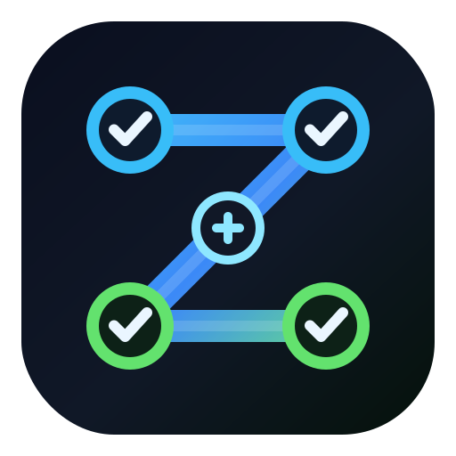

<p align="center">
  
</p>

<h1 align="center">Agent Operator Skills</h1>

<p align="center">
  Reusable AI-agent skills for planning, audits, security reviews, changelogs, CLIs, SEO, and multi-step coding loops.
</p>

<p align="center">
  <a href="LICENSE"></a>
  
  
  
</p>

## Why This Exists

Most agent prompts are too vague. They ask an AI to "be careful" or "do better" without giving it a repeatable operating pattern.

This repo is a curated set of public skills that make coding agents more disciplined:

- break large work into reviewable chunks
- force verification before claiming completion
- audit high-stakes output for weak assumptions
- generate release notes and changelogs from real evidence
- run technical SEO and security workflows with concrete checks
- keep private names, accounts, local paths, and customer data out of public skills

Star this repo if you want a clean reference set for building safer, more useful agent workflows.

## Included Skills

| Skill | Best For |
| --- | --- |
| [`codex-improvement-loop`](skills/codex-improvement-loop/SKILL.md) | Coordinating large coding initiatives with scoped workers, reviewers, loop state, and verification gates. |
| [`honest-output-auditor`](skills/honest-output-auditor/SKILL.md) | Auditing important outputs before calling them done. |
| [`security-best-practices`](skills/security-best-practices/SKILL.md) | Applying framework-specific secure-coding guidance for Python, JavaScript/TypeScript, Go, React, Next.js, Express, Django, Flask, FastAPI, Vue, and jQuery. |
| [`security-threat-model`](skills/security-threat-model/SKILL.md) | Producing repo-grounded AppSec threat models with evidence anchors and abuse paths. |
| [`security-ownership-map`](skills/security-ownership-map/SKILL.md) | Finding ownership risk, bus factor, and sensitive-code stewardship gaps from git history. |
| [`seo-audit`](skills/seo-audit/SKILL.md) | Running and interpreting technical SEO audits for websites and local previews. |
| [`cli-creator`](skills/cli-creator/SKILL.md) | Building small, composable CLIs from APIs, scripts, docs, or admin workflows. |
| [`changelog-generator`](skills/changelog-generator/SKILL.md) | Turning git history into user-facing changelogs and release notes. |
| [`define-goal`](skills/define-goal/SKILL.md) | Turning fuzzy intentions into concrete, measurable agent goals. |

## Fast Start

Clone the repo:

```bash
git clone https://github.com/zgroves24/agent-operator-skills.git
cd agent-operator-skills
```

Copy one skill into your agent's local skill directory:

```bash
cp -R skills/honest-output-auditor ~/.codex/skills/
```

Or copy the whole public set:

```bash
cp -R skills/* ~/.codex/skills/
```

Other agent systems can use the same folders if they support a `SKILL.md` style layout.

## Recommended Combos

| Goal | Skills |
| --- | --- |
| Big codebase improvement | `codex-improvement-loop` plus `honest-output-auditor` |
| Security review | `security-best-practices`, `security-threat-model`, `security-ownership-map` |
| Release prep | `changelog-generator` plus `honest-output-auditor` |
| Website quality pass | `seo-audit` plus `honest-output-auditor` |
| Turn a repeated workflow into tooling | `define-goal` plus `cli-creator` |

## What Makes These Different

Each public skill is expected to have:

- a clear trigger
- concrete workflow steps
- verification gates
- blocked-state behavior
- no private account assumptions
- no personal data
- no product-specific claims

See [`docs/skill-quality-rubric.md`](docs/skill-quality-rubric.md) for the bar used before publishing a skill here.

## What Is Not Included

This repo intentionally excludes:

- personal admin workflows
- private product workflows
- outreach, analytics, ads, vault, or screen-history workflows tied to one local setup
- vendor-owned skills already published elsewhere
- private names, emails, paths, customer data, tokens, cookies, or secrets

See [`SANITIZATION_AUDIT.md`](SANITIZATION_AUDIT.md) and [`PROVENANCE.md`](PROVENANCE.md) for the publication notes.

## Assets

- [`assets/agent-operator-skills-mark.svg`](assets/agent-operator-skills-mark.svg) is the lightweight repo mark.
- [`assets/agent-operator-skills-logo.png`](assets/agent-operator-skills-logo.png) is the generated launch logo.
- [`assets/agent-operator-skills-profile.png`](assets/agent-operator-skills-profile.png) is a square profile-size version.

## Contributing

See [`CONTRIBUTING.md`](CONTRIBUTING.md). New skills should be portable, specific, audited, and useful outside one private workspace.

## License

Apache-2.0. See [`LICENSE`](LICENSE).

This is not an official OpenAI, Anthropic, Vercel, GitHub, or platform-owned repository.
